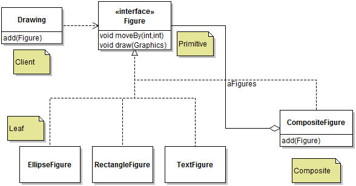
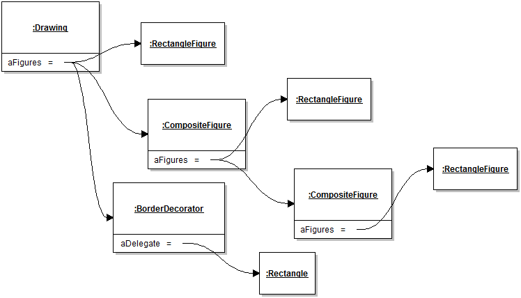

# Module 5 - Composition

## Description

Large programs are typically assembled from smaller parts. In object-oriented programming this is done through two main mechanism: *composition* and *inheritance*. Composition simply means that one object holds a reference to another object and delegates some tasks to it. Although this sounds simple enough, unprincipled composition can lead to a terrible mess of spaghetti code. In this module I will give a quick refresher on the mechanism of polymorphism and how it can be used to elegantly compose objects together by following some well-known design patterns. Note that the second way of assembling systems is through inheritance, which is more complex and will be covered in Module 7.

## Learning Objectives

After this module you should:

* Be able to explain the concept of object composition and its impact on object identity;
* Be able to use the Composite design pattern effectively;
* Be able to use the Decorator design pattern effectively;
* Be able to use the Command design pattern effectively;
* Be able to use the Prototype design pattern effectively;
* Understand the concept of polymorphic copying and be able to correctly use the Java cloning mechanism;
* To understand the Law of Demeter and be able to apply it;
* Generally solve design problems that involve manipulating object graphs;

## Notes

### General Concepts and Definitions

A general strategy for managing complexity in software design is to define larger abstractions in terms of smaller, ideally simpler ones. In practice one way to do this is **object composition**. Composing objects simply means that one object stores a reference to one or more other objects. Conceptually we could say composition can help achieve two purposes. On purpose is for one object to conceptually **aggregate** other objects and provides operations that are a function of these aggregated objects. An example is an instance of a class `Deck` that aggregates instances of class `Card`. In this case the methods of `Deck` basically are functions that operate on instances of `Card`, for example by shuffling them. Another way to understand composition is the idea of **delegation**, in that the container object *delegates* some services to the objects it contains. For example, in the Solitaire demonstration system, the `GameEngine` singleton object holds a reference to an instance of a `SuitStackManager` and *delegates* all the management of the state and computation of "suit stacks" to that object. The two purposes for composition are not mutually exclusive.

In a UML Class Diagram object composition is represented with an edge annotated with a diamond *on the side of the class whose instances hold the reference to the instances of the other class*. Note that the UML notation technically allows the distinction between two types of composition: "aggregation" (white diamond) and "composition" (black diamond). I don't work with this distinction in the course, and exclusively use the "white diamond" annotation for all types of aggregation/compositions.

Although it is technically possible to combine objects in arbitrary ways simply by defining class fields and passing object references around, unprincipled use of object composition quickly degenerates into overly-complex code. In this module I cover different ways to keep a certain amount of organization in the use of composition. 

### UML Sequence Diagrams

This module will discuss different ways to have groups of objects interact. The best way to model sequences of object interactions is through [UML Sequence Diagrams](http://www.ibm.com/developerworks/rational/library/3101.html). Just like object diagrams and state diagrams, Sequence diagrams model the *dynamic* perspective on a software system. Like object diagrams and as opposed to state diagrams, Sequence Diagrams represent *a specific snapshot* in the execution of a program. They are the closest correspondence to what one would see in the debugger's execution stack as the code is executing.

I describe the notation of Sequence Diagram through an example. The scenario modeled is the use of an iterator in the Iterator design pattern seen in [Module 2](Module-02.md). The names of model elements are provided as notes on the diagram. 

Each rectangle at the top of the diagram represents an **object**. Consistently with other UML diagrams representing system rum-time, the objects names are underlined and follow the convention `name:type` as necessary. Note how I did not give a type to the client because it does not matter, and did not give a name to the `Deck` instance because it does not matter.

The dashed vertical line emanating from an object represents the object's **lifeline**. In systems terms it represents the time (running top-down) when the object exists, i.e., between its creation and the time it is garbage collected. The correspondence of the lifeline to state diagrams is the time between the start and end state. When objects are placed at the top of the diagram, they are assumed to exist at the beginning of the scenario being modeled. It is also possible to show the creation of the instance by placing it lower in the diagram (e.g., the `Iterator` object). When representing the type of an object, there is some flexibility in terms of what type to represent in the object's type hierarchy (e.g., the concrete type of the object or one of its supertypes). As usual when modeling, we use what is the most informative. Here the `Deck` object is represented using its concrete type because that's really the only option, but for the `Iterator` object I used the inteface supertype because in practice the concrete type of this object is anonymous and doesn't really matter.

**Messages** between objects typically correspond to method calls. Messages are represented using a directed arrow from the caller object to the called object. By "called object" we precisely mean "the object that is the implicit parameter of the method call". Messages are typically labeled with the method that is called, optionally with some symbol representing arguments, when useful. When creating a Sequence Diagram that represents an execution of a Java program, it is likely to be a modeling error if a message incoming on an object does *not* correspond to a method of the object's class. Constructor calls are modeled as special `create` messages.

Messages between objects induce an **activation box**, which is the thicker white box overlaid on the lifeline. The activation box represents the time when a method of the corresponding object is on the execution stack (but not necessarily on the top of the execution stack).

It is also possible to model the **return of control** out of a method back to the caller. This is represented with a dashed directed arrow. Return edges are optional. I personally only use them to aid understanding when there are complex sequences of messages, or to give a name to the value that is returned to make the rest of the diagram more self-explanatory. Here for example, I included a return edge from both `iterator()` calls to show (indirectly) that it's probably the same object being propagated back to the client. I also included a return edge from the `next()` method and labeled it `nextCard` to show that the returned object is the one being supplied to the subsequent **self-call** (a method called on an object from within a method already executing with this object as implicit parameter).

My usual reminder about the distinction between models and complete source code applies to sequence diagrams as well. First, a sequence diagram *models a specific execution, not all executions*. In the above example, a different execution could have received `false` from `hasNext()` and not called `next()`, or called `next()` twice, etc. These options are not represented, because they are different scenarios. Second, sequence diagrams will naturally *omit some details* of the execution of the code. We use sequence diagrams to show how objects interact to convey a specific idea. Although UML supports the specification of looping and conditional statements within a method, these are typically not included and I don't use this notation in the course. Insignificant calls (e.g., to library methods) are also typically omitted from sequence diagrams.

### The Composite Design Pattern

It's not usual when designing aggregations of objects to run into a situation where we would like to have groups of objects behave like single objects. This situation is best illustrated by the following design fragment for a hypothetical drawing editor.

In this design, a `Drawing` instance aggregates a number of different `Figure` objects. A usual desirable feature of the problem domain (drawing figures) is that it should be possible to create figures by grouping different figures. This feature is realized in the design by the presence of class `CompositeFigure`. In the pattern this is referred to as the "Composite" role. Roles in the pattern are indicated using notes in the UML diagram. In this pattern the Composite class has two very important features:

0. It aggregates a number of different objects of type `Figure`. Using the primitive (interface) type is very important, as it allows the composite to compose any other kind of figures, including other composites.
0. It implements the primitive interface. This is basically what allows composite objects to be treated by the rest of the program in exactly the same way as "leaf" elements.

An example of the resulting structure is illustrated by the object diagram below.

When instantiating the Composite design pattern as part of a design, a few important issues must be considered:

* Whether to have a single composite class for all different types of composite, or whether to have an abstract composite class that is subclassed by other more specific types of composites. Because inheritance is covered later in the course, we set this issue aside for now.
* The composite needs a way to add the instances of the primitive that it composes. This can be done using the constructor, or an `add` method. In the case of an `add` method, the question becomes whether to include the `add` method in the `Primitive` or not. The more common solution is to not include it in the primitive, but there may be some situations where it makes more sense to include it on the interface, for example to simplify code that makes heavy use of the `instanceof` operator.

Some practical aspects related to using the pattern are independent from the structure of the pattern itself. These include:
* The location of the creation of the composite.
* Any logic required to preserve the integrity of the object graph induced by this design (e.g., to prevent cycles, or non-sensical groups). Because these concerns are problem-dependent, their solution will depend on the specific design problem at hand.

## Reading

* Textbook 3.4.5, 5.5-5.8, 7.4, 10.2
* JetUML v1.0: The [ToolBar](https://github.com/prmr/JetUML/blob/v1.0/src/ca/mcgill/cs/stg/jetuml/framework/ToolBar.java) class and its [design docs](https://github.com/prmr/JetUML/blob/v1.0/doc/functional/toolbar.md) show a near-classic implementation of the Prototype design pattern.
* Solitaire v0.3 implements the Command pattern though interface [Move](https://github.com/prmr/Solitaire/blob/v0.3/src/ca/mcgill/cs/stg/solitaire/model/Move.java)
* Solitaire v0.3 implements the Composite pattern though class [CompositeMove](https://github.com/prmr/Solitaire/blob/master/src/ca/mcgill/cs/stg/solitaire/model/CompositeMove.java)

## Exercises

Exercises prefixed with **(+)** are optional, more challenging questions aimed to provide you with additional design and programming experience. Exercises prefixed with **(P)** (for "project") will incrementally guide you towards the ultimate completion of a complete Solitaire application.

---

Unless otherwise noted, the content of this repository is licensed under a <a rel="license" href="http://creativecommons.org/licenses/by-nc-nd/4.0/">Creative Commons Attribution-NonCommercial-NoDerivatives 4.0 International License</a>. 

Copyright Martin P. Robillard 2017