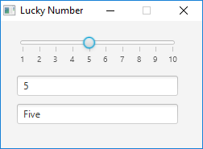
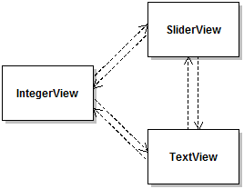
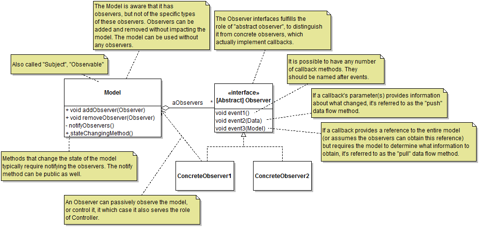
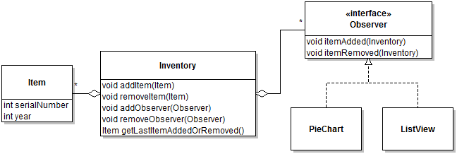
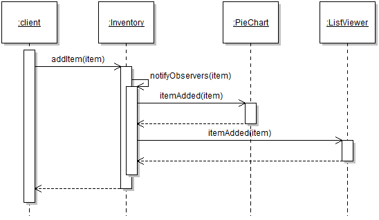
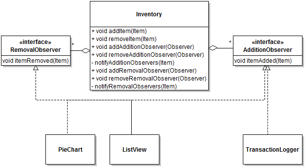

## Module 6 - Inversion of Control

## Description

The idea of inversion of control is one of the most powerful intellectual tools in a software designer tool-box. It allows us to build incredibly sophisticated applications while keeping the overall design complexity down to a manageable level. The Observer pattern is extremely common in software development, and it's realized by most GUI toolkits on most software development platforms, from desktop to web to mobile applications. This module is dedicated to the principle of inversion of control (IoC) and its realization in the Observer pattern, also called the Model-View Controller (MVC) pattern.

## Learning Objectives

After this module you should:

* Be able to use the Observer design pattern effectively;
* Be able to design and implement simple graphical user interfaces with Swing and JavaFX;
* Understand the concept of an application framework;

## Notes

### Motivation

One of the main problems that motivates inversion of control in design is situations where a number of objects need to be kept consistent with a certain state. An example from the programming domain itself is an integrated development environment like Eclipse, which presents different views of the code. For example, the Outline View shows the outline of a class that can also be viewed in the text editor, etc.
I illustrate a simpler instance of this problem with the [LuckyNumber](artifacts/module-06/module6/LuckyNumber.java) toy application. When launched this application shows a number between 1 and 10 in three different ways (or with three different *views*:

Each view of the number also allows the user to change the number, and the change is immediately reflected in all views.

A naive (and inferior) way to implement this functionality is through *complete pairwise dependencies*.

This design suffers from (at least) the following two inter-related limitations:

* **High coupling**: Each panel explicitly depends on many other panels.
* **Complexity**: Complex idiosyncratic program logic is required to keep the different panels consistent.
* **Low Extensibility**: To add or remove a panel, it is necessary to modify all other panels. 

Furthermore, these limitations all increase quadratically in the number of panels, given that there are `n*(n-1)` directed edges in a complete graph with `n` vertices.

The way out of this design antipattern is to separate program elements responsible for *storing state* from program elements responsible for *viewing state*, from program elements responsible for *changing state*, and to use various mechanisms to achieve loose coupling between these. This profoundly influential idea is commonly known as **the Observer Design Pattern** or (somewhat alternatively) **the Model-View-Controller** architecture (MVC). In this course I stick to the "Observer pattern" terminology, but it's good to be aware that in other contexts people may talk about the MVC and refer to essentially the same thing.

### The Observer Design Pattern

The central idea of the Observer design pattern is to store state of interest in specialized objects, and to allow other objects to *observe* this state. The class diagram below illustrates how this is realized for the LuckyNumber application.

In this situation, the object in charge of keeping state is an instance of `Model`. The `Model` class in the Oberver design pattern can alternately be called "Subject", or even "Observable". Here an instance of `Model` simply keeps track of an integer and allows clients to query and mutate this integer. Where things become interesting is that the `Model` class also includes an aggregation to an `Observer` interface, with methods to add and remove `Observer` instances from its collection. This is also called *(de)registering* observers. Classes that define objects that would be interested in observing the state of the model must then declare to implement the `Observer` interface. Through polymorphism, we thus achieve loose coupling between the model and its observers. Specifically:

* The model can be used without any observers;
* The model is aware that it can be observed, but its implementation does not depend on any concrete observer class.
* It is possible to register and de-register observers at run-time.

Two key questions about the relation between a model an its observers are:

* How do the observers learn that there is new information in the model that they need to know about?
* How do they access this information?

The answer to the first question is that whenever the model determines that there is a change in the model worth reporting to observers, it cycles through the observers and calls a certain method on them. This method has to be defined on the `Observer` interface and is usually called a "callback" because of the inversion of control that it represents. We talk of inversion of control because to find out information from the model the observers do not call a method on the model, they instead "wait" for the model to call them. This is often referred to as the "Hollywood Principle" ("don't call us, we'll call you"). That is also why the method that is called by the model on the observer is called a "callback". The following sequence diagram illustrates what happens when we change the model on the "LuckyNumber" application.

Here, inside the state-changing method `setNumber(int)`, we added logic to loop through each observer and call the method `newNumber` on each. This `newNumber` method is a "callback" that the observers will expect to be called every time there is a state change in the model. The implementation of the callback dictates how each observer reacts to the change in state. 

Another way to think about callback methods is as "events", with the model being the "event source". With this paradigm, the model generates a series of "events" that correspond to different state changes, and other objects are in charge of reacting to these events. What events correspond to in practice is simply methods calls.

The figure below provides a summary of the main roles of the Observer pattern and their relation.

Variation points for the Observer design pattern include:

* Whether to make the `notifyObserver` methods public or private. If public, clients with references to the model get to control when notification are issued. If private, it is assumed that the method is called at appropriate places in the state-changing methods of the model.
* What callbacks methods to define on an abstract observer. An abstract observer can have any number of callbacks that can correspond to different types of events.
* What data flow method to use to move data between the model and observers (push, pull, none, or both, as appropriate).
* Whether to use a single abstract observer or multiple ones. Multiple abstract observers with different combinations of callbacks give clients more flexibility to respond to certain events or not.
* How to couple observers with the model if observers need to query or control the model. Here the use of the interface segregation principle is recommended.

### Observer Design Case Study

Let's consider how we would approach the following question:

> We are interested in an inventory system capable of keeping track of electronic equipment. An `Item` of equipment records a serial number (`int`) and production year (`int`). An `Inventory` object aggregates a bunch of `Item`s. Clients can add or remove `Item`s from the `Inventory` at any time. Various entities are interested in changes to the state of the `Inventory`. For example, it should be possible to show the items in the `Inventory` in a `ListView`. It should also be possible to view a `PieChart` representing the proportion of `Item`s in the `Inventory` for each production year (e.g., 2004=25%; 2005=30%, etc.). Views should be updated whenever items are added or removed from the Inventory.

As a first take on this problem we can model the basic elements of the domain with a class diagram:

This diagram captures all the relevant domain elements but, little else. The following step is to instantiate a basic Observer pattern. At this stage this simply requires realizing which domain object plays which role. Here the object containing the observable state would be instances of `Inventory`, and the objects observing this state would be `PieChart` and `ListView`.

Now the basic mechanism for linking observers with the `Inventory` is visible, but some of the interesting questions are left unanswered. At this point we need to design callback methods. Since there are only two possible events in this simple problem (adding and removing items), there are two choices for callbacks:

* A single callback that indicates that an item was added or removed;
* One callback for items added and one for items removed.

Here the first option would end up being called something like `itemAddedOrRemoved` and concrete observer would have to check a boolean flag to determine what happened. This option clearly has the smell of being not quite right. Indeed the second one is the more elegant choice. The final question how to tell observers which item has been added or removed. Using the pull method, we could include a reference to the `Inventory` that changed as part of the callback, and add a method `getLastItemAddedOrRemoved()`:

Although potentially workable, this solution both looks and is clumsy. A much more natural option here seems to be to simply pass the added/removed item to the callback, to have something like `itemAdded(Item)`. Another somewhat more radical option, is to make the `Inventory` `Iterable<Item>` and to expect the observers to refresh themselves completely every time they receive an event. In some cases this make sense, but here let's stick to the use of the push model.

The last question is how to trigger notifications. Here we'll choose to add a private `notifyObservers` method that is automatically called whenever `addItem` or `removeItem` is called.

The current class diagram is thus:

Assuming two observers (one of each type) are registered with the inventory, a sequence that illustrates an item being added is thus:

Note the following details:

* The `notifyObservers` method takes in a parameter to facilitate its implementation. Why that is will become apparent in the practice exercises.
* The names of the methods on the `Observable` describe *commands* such as `addItem`, whereas the names of the call back describe the corresponding *result of the command as an event in the past*, such as `itemAdded`. The use of effective names greatly contributes to the usability of the Observer pattern.

Finally, let's assume that after using this design in a version of the system, a new type of observer is added, called the `TransactionLogger`. This type of observers is only interested in items being added to the inventory. In the current design, the class would have to implement the `itemRemoved` callback to do nothing. In this case, we can improve the design to allow different types of observers to register to only the events they care about. However, note that this doubles the number of observer management methods on the model.

## Reading

* Textbook 5.3, 8.1, 8.4;
* The [JavaFX Tutorial](http://docs.oracle.com/javafx/2/get_started/hello_world.htm)
* Solitaire v0.3 The [DeckView](https://github.com/prmr/Solitaire/blob/v0.3/src/ca/mcgill/cs/stg/solitaire/gui/DeckView.java) class as an example of a GUI observer.

## Exercises

Exercises prefixed with **(+)** are optional, more challenging questions aimed to provide you with additional design and programming experience. Exercises prefixed with **(P)** (for "project") will incrementally guide you towards the ultimate completion of a complete Solitaire application.

0. Extend the code of [LuckyNumber](artifacts/module-06/module6/LuckyNumber.java) to include a Roman Numerals panel.
0. Write a JavaFX application with a button and a label, which writes the current date and time in the label every time the button is pressed. You can obtain the current date and time with the following API call `new Date().toString();` 
0. Write the code that implements a skeleton application that corresponds to the Observer Design Case Study. Write a driver program that adds and removes item to make sure everything works as expected. Experiment with different design variants.

---

Unless otherwise noted, the content of this repository is licensed under a <a rel="license" href="http://creativecommons.org/licenses/by-nc-nd/4.0/">Creative Commons Attribution-NonCommercial-NoDerivatives 4.0 International License</a>. 

Copyright Martin P. Robillard 2017