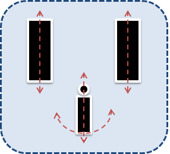

## Module 8 - Design Patterns

## Description

This module will explore design solutions that incorporate design patterns an inheritance and introduce the Visitor design pattern.

## Learning Objectives

After this module you should:

* Be able to use the Visitor Design Pattern effectively;
* Be able to determine when inheritance can be effectively used within different design patterns including the Visitor, Decorator, Composite, Command, and Strategy patterns.
* Be able to correctly instantiate design patterns with inheritance.

## Reading

Textbook: Section 10.6;

## Notes

### Visitor Design Pattern

### Design Pattern Review Scenario

We will explore how to combine design patterns by creating a design for a hypothetical mobile robotics system. In this system, a `Robot` class represents a three-wheeled robot with two active wheels and one free wheel that can also rotate around a pivot. The `Robot` class provides very basic control primitives through a method `void moveLeft(double pRadians)` and a similar method for moving the right wheel. The `pRadians` parameter specifies how much to turn the wheel, e.g., `pRadians=2&#960;` turns the wheel a full circle.

We want to expand this design to implement the following requirements:

0. It should be possible to define higher-level commands for the robot in terms of the basic primitives. For example it should be possible to define a "Forward Move" command that moves both wheels by the same amount. The number of different commands should be extensible;
0. Commands should be parameterizable, e.g., "move forward 1 meter" vs 2 meters, etc.
0. Any command should be reversible;
0. Commands should have a name that can be discoverable at run time. For example, a "Move forward 1 meter".
0. It should be possible to aggregate commands into more complex "macro commands". For example, a "Back and Forth" command could involve a forward move followed by a backward move.
0. It should be possible for components in the system other than the robot to be notified of commands issued on a `Robot` object. Three components interested in robot commands include a `CommandLogger` that prints all commands with a time stamp, `CommandRecorder` that can be issued a request to record commands (or to stop recording them), and to control the robot to replay the recording; a `RobotConsole` component that visually shows the path of the robot in a graphical user interface.
0. The system should remember the last command issued to a robot, and provide a convenience method `reexecute()` to re-execute this command. The reexecution of the command should be considered a new, separate command.

In addition to these requirements, the final design should exhibit a number of qualities:
* Effective code reuse: the design should limit code duplication;
* Loose coupling: classes should not depend on interfaces they do no need;
* Robustness: The likelihood of `NullPointerExceptions` should be, well, null.

## Exercises

Exercises prefixed with **(+)** are optional, more challenging questions aimed to provide you with additional design and programming experience. Exercises prefixed with **(P)** (for "project") will incrementally guide you towards the ultimate completion of a complete Solitaire application.

---

Unless otherwise noted, the content of this repository is licensed under a <a rel="license" href="http://creativecommons.org/licenses/by-nc-nd/4.0/">Creative Commons Attribution-NonCommercial-NoDerivatives 4.0 International License</a>. 

Copyright Martin P. Robillard 2017