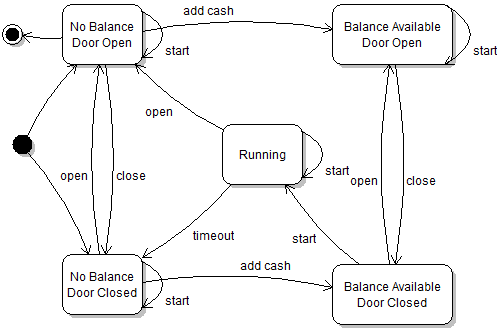
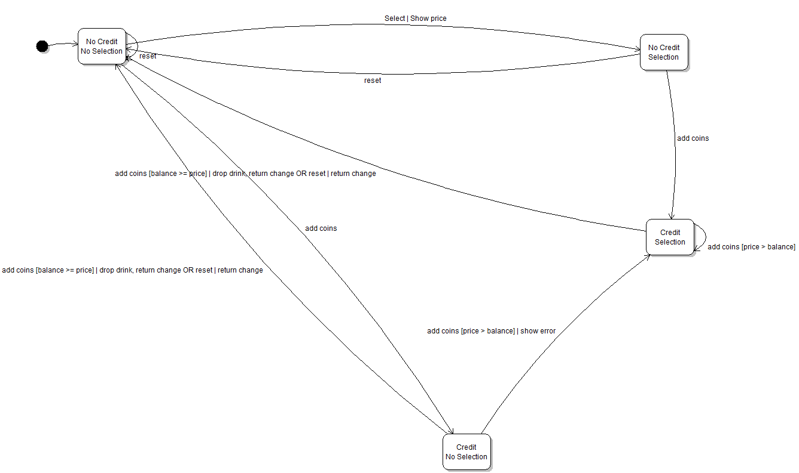

# Module 3 - Answers

Answers and answer sketches to the Module 3 practice exercises.

## Exercise 1

The key insight here is that the state of the door (open or closed) needs to be reflected in the modeled abstract states. Note that the state diagram captures information on how the "start" button works. Because every state has a transition labeled "start", it means it's always possible to press the "start" button, it simply happens to do nothing except in the case where there's a balance and the door is closed. Not including the "start" self-transitions would actually be a different specification for the machine. It would mean that it is physically impossible to press the button except when it can start the machine (in the sense that the button is mechanically blocked or something). Assuming whoever uses the machine actually wants to get their dry laundry back, it makes sense to include an end state.



## Exercise 2



## Exercise 3

See the implemented [Card](https://github.com/prmr/Solitaire/blob/v0.3/src/ca/mcgill/cs/stg/solitaire/cards/Card.java) class. Note that there are different ways to implement the Flyweight collection. An alternative would be using lazy initialization of a double hash table.

## Exercise 4

**Sketch:** You can implement a class `WorkingStack` that is a wrapper for a `java.util.Stack`. To record which card is visible or not, many different strategies are possible. For example, you could have a separate field `aVisible` of type `Set<Card>` in which you add cards as they become visible. The sample [WorkingStackManager](https://github.com/prmr/Solitaire/blob/v0.4/src/ca/mcgill/cs/stg/solitaire/model/WorkingStackManager.java) in the completed Solitaire application does things a bit differently, by managing all working stacks through a single class, which is slightly different from what is required for this exercise.

## Exercise 5

The minimum necessary to realize the Singleton pattern is as follows:

```java
public final class GameModel implements GameModelView
{
   private static final GameModel INSTANCE = new GameModel();
   
   /**
    * @return The singleton instance for this class.
    */
   public static GameModel instance()
   {
      return INSTANCE;
   }
}
```

## Exercise 6

See the fully implemented [GameModel](https://github.com/prmr/Solitaire/blob/v0.4/src/ca/mcgill/cs/stg/solitaire/model/GameModel.java) for a sample.

## Exercise 7