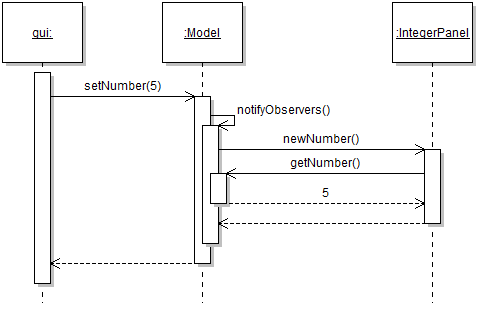

# Module 6 - Answers

Answers and answer sketches to the Module 6 practice exercises.

## Exercise 1

The easiest solution is to copy class `TextPanel` to something like `RomanPanel` and to update the string literals from English to Roman numerals (e.g., "Two" becomes "II"). You
can leave zero as is, since the Romans were unaware of this concept (and the string for zero is not displayed anyways). To add the panel to the application, simply add this statement at the appropriate place 
in method `start`:

```java
root.add(new RomanPanel(model), 0, 3, 1, 1);
```

The point of this exercise was to demonstrate how the Observer pattern makes it very easy to add/remove views without affecting the rest of the code.

## Exercise 2

The main change is that the callback no longer has a parameter. This requires documenting how the concrete observers can access the model data. In the diagram this is represented by the aggregation to the `Model` and the parameter in the constructor, which clarifies how this aggregation is acquired. The other concrete observers are left out without loss of generality.


In the code, besides updating the signature of the callback method, the number in the model needs to be accessed from the reference to the model, for example in `IntegerPanel`:

```java
@Override
public void newNumber()
{
   aText.setText(new Integer(aModel.getNumber()).toString());
}
```

The sequence required to update the observers becomes a bit more complex:

